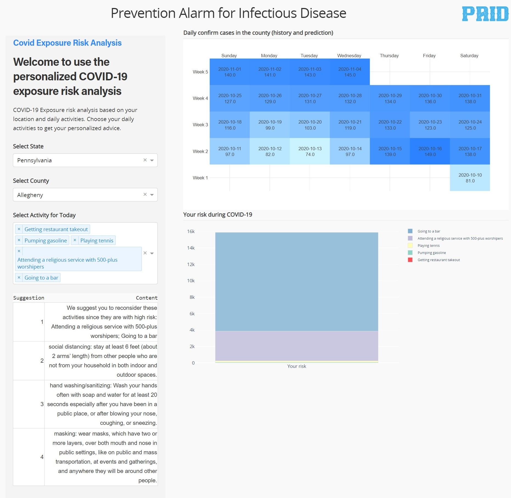

# PAID - Prevention Alarm for Infectious Disease

## About this app

Based on your location, we will give you the most prioritized prevention to the current pandemic 

## Inspiration
1. Information Overwhelming
~Too many data available but not systematic or provide specific guidance
~Tracing map? What do those statistic numbers mean? Prevention methods? 
2. Fake Information
~Too many controversial news and information spreading
~Masking or not? What kind of mask to wear? How to wash hands properly? 

## What it does
1. To provide guidelines for users to follow when users plan to do activities
~Direct and straightforward advice, yet support with evidence
~Be specific to local data and timely stratified 
~Wording in plain English, easy to understand
~Increasing the awareness and lower the effective reproduction rate (Re)

## How I built it
1. Building environment: Python
~Layout Design: easy to obtain information 
~Specific Function Panels Design: information input/output
2. Google Cloud Database
~Connect the COVID-19 data 
~Data Visualization: easy to understand

## Challenges I ran into
1. Different elements adding to the function panel
~ Adding different elements, e.g. Dropdown list, select list
2. Connect the database to the WebApp
~COVID-19 database from the Google Cloud 
~Data visualization in Calendar format

## Accomplishments that I'm proud of
1. We are appealing to primary literature and raw data but not simply tertiary resources such as CDC or WHO guidelines
2. We apply knowledge of epidemiology and biostatistics and try to realize it through coding language

## What I learned
1. WebApp design experience
~Basic knowledge of the WebApp design
~Connect database to the WebApp 
~Visualization of the input/output elements from user side
~Stronger team work
~More experienced with the coding language
2. Team work is important
~Team work is the promise of efficiency

## What's next for GPS tracing for COVID-19
1. Granting real-time location access from the user to further personalize the recommendations on scheduling their activities by avoiding crowds if possible
2. Include specific clinical-based evidence on the prevention techniques for those users who would like to further understand their actions
3. Able to access this system on multiple platforms (web and app)
4. Able to answer users’ questions when they are exposed to the disease and provide possible resources in their community on where to seek help

## Screenshot

## Resources

* [Dash](https://dash.plot.ly/)